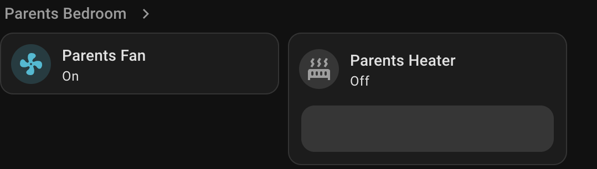
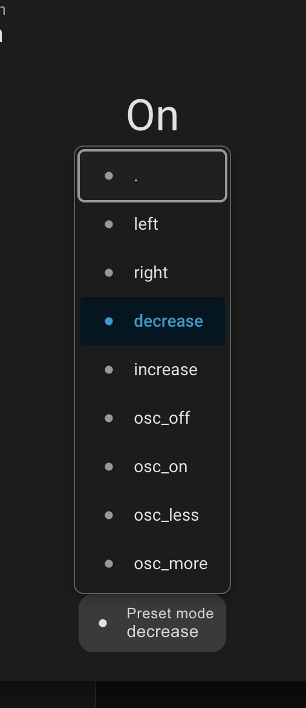

# IR Fan Control

[](https://github.com/Tipana/ir_fan_control)
[](LICENSE)
[](https://www.home-assistant.io/)

Make IR-only fans and heaters feel native in Home Assistant by exposing them as `fan.*` entities.

> **Quick Start**
> 1. Copy `custom_components/ir_fan_control` into `/config/custom_components/`
> 2. Restart Home Assistant
> 3. Add integration: **Settings -> Devices & Services -> Add Integration -> IR Fan Control**

> **One-command deploy (this repo -> live HA)**
> ```bash
> ./deploy.sh
> ```

> **Quick lint check**
> ```bash
> ./lint.sh
> ```

## Table of Contents
- [Why This Exists](#why-this-exists)
- [Features](#features)
- [Install](#install)
- [Deploy Workflow](#deploy-workflow)
- [Linting](#linting)
- [Configuration](#configuration)
- [Automation Examples](#automation-examples)
- [Screenshots](#screenshots)
- [Troubleshooting](#troubleshooting)
- [FAQ](#faq)

## Why This Exists
This project started around the Shark Pro Mist fan and matching Shark heaters.  
Great hardware, no practical smart integration.

Home Assistant + Zigbee2MQTT can transmit IR, so this integration maps learned IR codes into clean, automatable entities without template/script sprawl.

## Features
- 🌬️ Exposes IR devices as native `fan.*` entities.
- 🔢 Handles discrete speed steps (`2` to `6`).
- ⚡ Optional turbo/boost command.
- 🎛️ Optional extra action buttons (left/right or timer/sensor style actions).
- 🌀 Oscillation modes: `toggle` or `levels`.
- 🧭 UI control mode: `slider` or `buttons`.
- 🛡️ Stable pacing profile (`stable-v1`) with stale-command cancellation.

## Install
### Option A: Git clone (recommended)
```bash
cd /config/custom_components
git clone https://github.com/Tipana/ir_fan_control.git ir_fan_control
```

### Option B: Download ZIP
1. Download this repository as ZIP.
2. Extract to `/config/custom_components/ir_fan_control`.
3. Restart Home Assistant.

### Add integration
1. Open **Settings -> Devices & Services**
2. Click **Add Integration**
3. Search **IR Fan Control**
4. Fill in MQTT topic + IR codes

## Deploy Workflow
Use this repository as your source of truth, then deploy changes into live HA:

```bash
./deploy.sh
```

If `/Volumes/config` is not mounted, the script exits with a clear message and does nothing.

## Linting
Run:

```bash
./lint.sh
```

What it does:
- syntax-checks all Python files in `custom_components/ir_fan_control`
- runs `ruff` checks if `ruff` is installed

## Configuration
Required:
- `name`
- `topic` (normally `zigbee2mqtt/<device>/set`)
- `power_code`
- `speed_up_code`
- `speed_down_code`

Common options:
- `control_mode`: `slider` or `buttons`
- `step_count`: `2-6`
- `pulse_delay`: default `0.5` works well on busy Zigbee networks
- `has_turbo` + `turbo_code`
- `has_direction` + `louver_left_code` + `louver_right_code`
- `left_label` / `right_label` for custom button names
- `direction_idle` to auto-return action preset to `idle`
- `has_osc` + `osc_mode` (`none` / `toggle` / `levels`)
- `osc_up_code` / `osc_down_code`

## Automation Examples
```yaml
- service: fan.turn_on
  target:
    entity_id: fan.parents_bedroom_fan_ir

- service: fan.set_percentage
  target:
    entity_id: fan.parents_bedroom_fan_ir
  data:
    percentage: 60

- service: fan.turn_off
  target:
    entity_id: fan.parents_bedroom_fan_ir
```

## Screenshots
<p>
  
  
</p>

## Troubleshooting
- **Icon/branding not updating**
  - Restart Home Assistant
  - Hard refresh app/browser cache
- **IR not firing**
  - Confirm topic uses `/set`
  - Validate base64 codes
  - Increase `pulse_delay` if network is congested
- **Commands feel delayed**
  - Close extra dashboard tabs/sessions
  - Check HA logs for websocket backlog warnings
- **Controls missing**
  - Check corresponding `has_*` options and codes are set

## FAQ
**Q: Is this only for Shark devices?**  
A: No. Any IR-controlled fan/heater works if you provide valid codes.

**Q: Can I use this for heater timer/sensor buttons?**  
A: Yes. Use `has_direction`, then map those two buttons to any one-shot IR actions and relabel them.

**Q: Can I rename "Preset mode"?**  
A: No. That label is owned by the Home Assistant frontend card.

**Q: Why does this integration use pacing?**  
A: Repeated IR sends over Zigbee can queue under load. `stable-v1` spaces bursts and cancels stale operations to keep control consistent.
